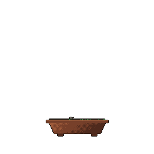

# Hey there! 👋 I'm Avani

**Data Scientist · ML Engineer · Knowledge Graph Wrangler**

I build things at the intersection of biomedical data, NLP, and machine learning — from RAG pipelines and search rankers to knowledge graph validation frameworks. Currently looking for my next adventure in applied ML / data science / health AI.

 

---

## 🛠️ What I work with

---

## 🔬 Selected Projects

| Project | What it does |
|---------|-------------|
| 🧠 [**NeuroQuery**](https://github.com/avanibhat/Neuroquery) | End-to-end RAG pipeline for biomedical literature — BioBERT embeddings, ChromaDB, LLM-as-judge evaluation, exposed as an MCP server |
| 🔍 [**Product Search Ranking**](https://github.com/avanibhat/product-search-ranking) | Learning-to-rank on Amazon ESCI — BM25 + sentence-transformer features → XGBoost LambdaMART, served via FastAPI + Docker |
| 🤖 [**Agentic Data Analyst**](https://github.com/avanibhat/agentic-data-analyst) | Autonomous analysis agent (LangGraph + Llama 3.3 70B) that profiles datasets, runs stats, detects anomalies, and writes reports |
| 🏥 [**Clinical Explorer**](https://github.com/avanibhat/hnsc-clinical-explorer) | Clinical data integration platform — survival analysis, patient similarity, deployed on HuggingFace Spaces · [Live Demo](https://huggingface.co/spaces/avanibhat/hnsc-clinical-explorer) |
| 🧬 [**Brain MRI Classification**](https://github.com/avanibhat/CNN_classification_Brain_tumor) | Deep learning for brain tumor classification (PyTorch, ResNet, Grad-CAM explainability) |

---

<!-- 

  
  

  

 -->

---

## 🎓 Background

- 🎓 **MSc Life Science Informatics** — University of Bonn
- 🔬 Thesis at **Fraunhofer SCAI** on knowledge graph validation for Alzheimer's Disease
- 💼 Former roles at **EMBO** (AI analytics) and **ZB MED** (hybrid retrieval systems)
- 🌍 Based in Germany · Open to roles across Europe

---

  <i>The bonsai on this page grows from my commit history — powered by <a href="https://github.com/egorthinks/git-bonsai">git-bonsai</a> 🌳</i>

- 🔭 Currently building hybrid retrieval systems and LLM-powered tools for biomedical data
- 🌱 Learning German (B1 in progress 🇩🇪) and diving deeper into information retrieval
- 💬 Ask me about knowledge graphs, RAG pipelines, or biomedical NLP
- 🧬 Fun fact: My bonsai style is *fukinagashi* (windswept) — apparently I'm a bursty storm-coder
-->
